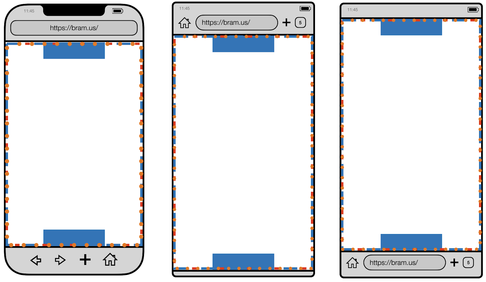
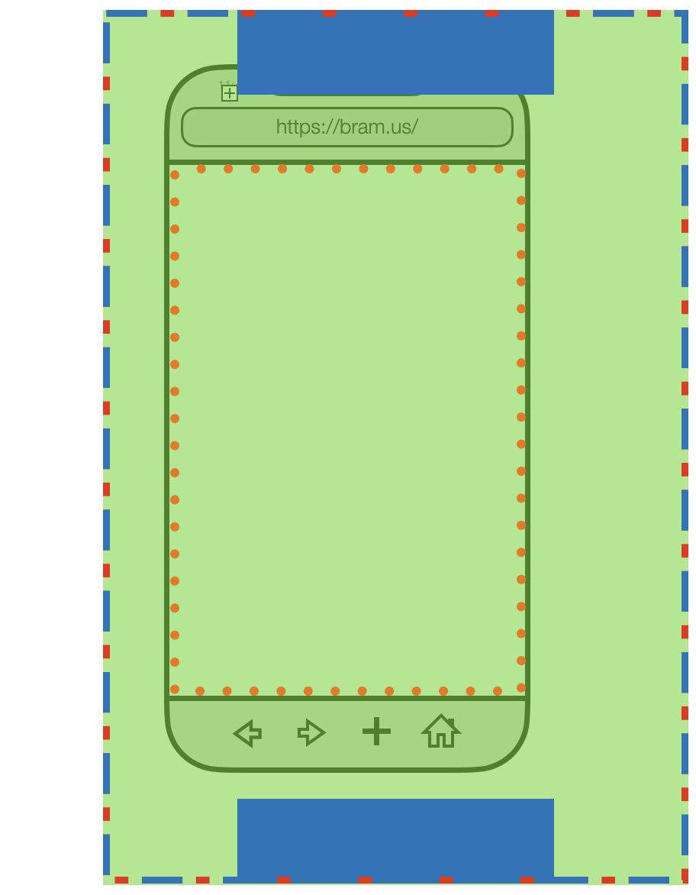
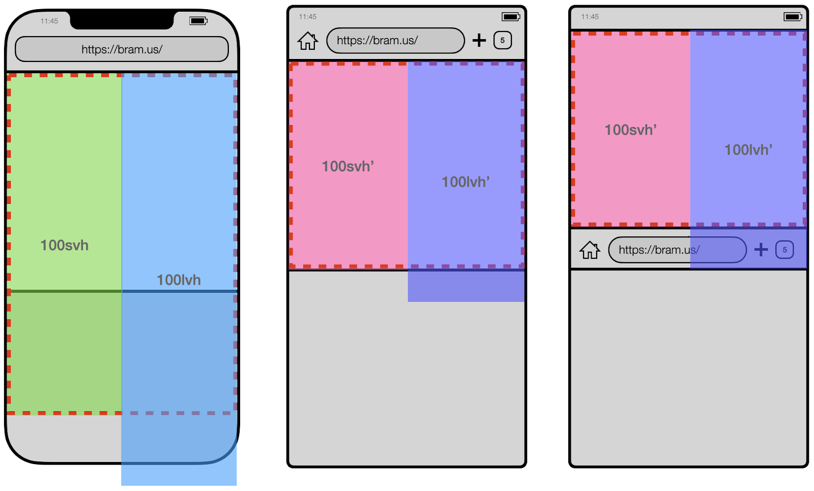
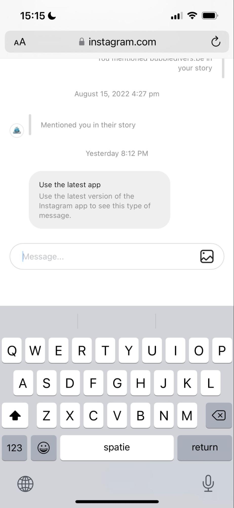
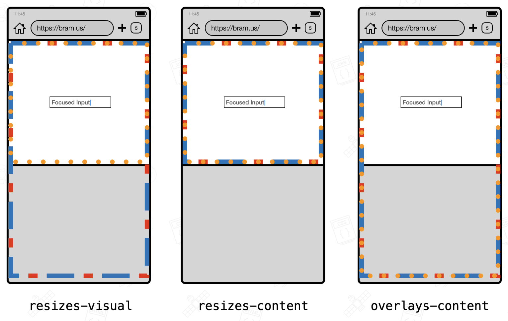

# Viewport vs Virtual Keyboard Resize Behavior

Authors: [Bramus](https://github.com/bramus/), [David Bokan](https://github.com/bokand), [Robert Flack](https://github.com/flackr), [Anders Hartvoll Ruud](https://github.com/andruud), [Chris Harrelson](https://github.com/chrishtr)

## Status of this document

This document is intended as a starting point for engaging the community and standards bodies in developing collaborative solutions fit for standardization. As the solutions to problems described in this document progress along the standards-track, we will retain this document as an archive and use this section to keep the community up-to-date with the most current standards venue and content location of future work and discussions.

- This document status: Active
- Expected venue: [CSSWG](https://drafts.csswg.org/)
- Current version: this document

## Introduction

On the web, when focussing an input or any other editable area, devices –mostly touchscreen devices– can show a Virtual Keyboard to allow users to enter content into the editable area. When doing so, User Agents respond in one of the following ways in relation to the Viewports.

1. Resize both the Visual Viewport and Layout Viewport
2. Resize only the Visual Viewport, and offset Layout Viewport
3. Do not resize any of the Layout Viewport or Visual Viewport, overlaying the Virtual Keyboard on top of both.

Each of the listed behaviors differently affects the size and/or position of certain elements on web pages, namely:

- Elements that rely on Viewport Units
- Elements that rely on `position: fixed;`
- Elements that are sized to take up the visual space

Depending on which behavior a User Agent + Platform combination a visitor uses, layout changes might occur, out of the control of the author.

This document proposes an extension the viewport meta tag so that authors get to opt in to any of those behaviors in a declarative manner.

```html
<meta name="viewport" content="width=device-width, initial-scale=1.0, virtual-keyboard=overlays-content">
```

This way, authors get to control which behavior a User Agent uses.

## Key terms

There are many terms used throughout this document. This section explains a few of the key terms used.

### The ICB

The [Initial Containing Block (ICB)](https://www.w3.org/TR/css-display-3/#initial-containing-block) is the containing block of [the root element](https://html.spec.whatwg.org/#the-html-element). For continuous media it has the dimensions of [the viewport](#the-layout-viewport) and is anchored at the canvas origin.

The ICB forms the basis of sizing and positioning for the root element’s box. Put differently: if you set the `<html>` element’s size to `100%` on both axes, it'll match the size of the ICB.

In the visualizations below, the ICB is given a red dashed border.

>
> 
> _Figure: Visualization of the ICB in Safari on iOS (left), Chrome on Android (center), and Firefox on Android (right)_

The size of the ICB is not affected by any dynamic toolbars the browser interface might have. These “dynamic toolbars” are User Agent Interface Elements that expand and retract as you interact with the page.

> 
> _Figure: Visualization of the ICB with contracted UA UI in various browsers. Note that the ICB does not get resized with the dynamic UA UI Elements contracted._

_ℹ️ Note: The ICB does get resized on one occasion: when [classic scrollbars](https://github.com/web-platform-tests/interop-2022-viewport/blob/main/explainers/scrolling.md#classic-scrollbars) are present. This is because the presence of those scrollbars resizes the Viewport. Since the ICB takes its size from that Viewport, it also gets resized. [Overlay Scrollbars](https://github.com/web-platform-tests/interop-2022-viewport/blob/main/explainers/scrolling.md#overlay-scrollbars) do not affect the Viewport nor ICB size._

### Viewport-Relative Lengths

The values for [Viewport-relative lengths](https://www.w3.org/TR/css-values-4/#viewport-relative-lengths) are derived from the size of the ICB. All browsers on all platforms agree on how this is done for the height:

- The [Small Viewport](https://www.w3.org/TR/css-values-4/#small-viewport-percentage-units) Height (`100svh`) is equal to the ICB’s height.
- The [Large Viewport](https://www.w3.org/TR/css-values-4/#large-viewport-percentage-units) Height (`100lvh`) is equal to the ICB’s height + height of any dynamic toolbars the browser has.

In the visualizations below, both the Small and Large Viewport Heights are visualized, along with the ICB.

> 
> _Figure: Visualization of the svh and lvh units, with expanded UA UI in various browsers._

> 
> _Figure: Visualization of the svh and lvh units, with contracted UA UI in various browsers._

Not visualized is the Dynamic Viewport, which adapts itself as UA UI Elements expand and/or contract. The value is in the range between the Small Viewport and Large Viewport value.

### The Layout Viewport

The Viewport – nowadays often referred to as “The Layout Viewport” – is [defined in the CSS2 spec](https://drafts.csswg.org/css2/#viewport) as _“a window or other viewing area on the screen through which users consult a document”_.

_ℹ️ Note: The Layout Viewport is a somewhat misleading name, as it is the viewport that is used to lay out items when using `position: fixed;` – A better name, in hindsight, might have been The Position Fixed Viewport._

If you were to apply the following CSS onto an element, it would take up the space of the Layout Viewport.

```css
/* This element will fill up the Layout Viewport */
el {
  position: fixed;
  inset: 0;
}
```

The size of the Layout Viewport adjusts when UA UI Elements get hidden. Its height is exposed through the `dvh` unit which also adjusts itself in a similar fashion.

In the visualizations below the Layout Viewport has been given a blue dashed border, and it also contains two FixedPos elements: one at the top edge and one at the bottom.

> 
> _Figure: Visualization of the Layout Viewport with 2 FixedPos Elements each (one at the top and one at the bottom)_

> 
> _Figure: Visualization of the Layout Viewport with 2 FixedPos Elements each (one at the top and one at the bottom). Note that the Layout Viewport follows the window’s `innerHeight`/`innerWidth`._

### The Visual Viewport

As [per MDN](https://developer.mozilla.org/en-US/docs/Web/API/Visual_Viewport_API):

> The visual viewport is the visual portion of a screen excluding on-screen keyboards, areas outside of a pinch-zoom area, or any other on-screen artifact that doesn't scale with the dimensions of a page.

Initially the Visual Viewport has the same size and position as the Layout Viewport. 

> 
> 
> _Figure: Visualization of the Visual Viewport (orange dotted outline). Note how it follows the Layout Viewport (blue dashed outline)._

Things change though once you pinch-zoom in, or when the Virtual Keyboard gets shown. As [per MDN](https://developer.mozilla.org/en-US/docs/Web/API/Visual_Viewport_API):

> When the user pinch-zooms into the page, the visual viewport shrinks but the layout viewport is unchanged. User-interface features like the on-screen keyboard can shrink the visual viewport without affecting the layout viewport.

When pinch-zooming in, the Visual Viewport shrinks in relation to the Layout Viewport, as it only shows part of the page.

> 
> _Figure: Visualization of the Visual Viewport on a pinch-zoomed page._

When focusing an input, the Visual Viewport shrinks as the OSK gets shown. If the input would be obscured by the OSK, browsers offset the Visual Viewport against the Layout Viewport so that the input remains in view.

> 
> _Figure: Visualization of the Visual Viewport on a page with the OSK shown._

The Visual Viewport is well supported by all major browsers:

- Chrome 61
- Firefox 91
- Edge 79
- Safari 13

Note that the Visual Viewport can not grow larger than the Layout Viewport. The Visual Viewport’s scrolling layer is the Layout Viewport.

## Problem Statement

### The side-effect of a resized ICB

While all browsers on all platforms derive the svh/lvh/vh units in the same manner – i.e. derive it from the size of the ICB – and resize the Layout Viewport as UA UI Elements appear/disappear, there’s a difference in how platforms behave when the Virtual Keyboard is shown.

We can distinguish two different behaviors:

1. Browsers that resize the Visual Viewport, leaving Layout Viewport untouched:
  - Safari on iOS
  - Safari on iPadOS
  - Chrome on CrOS
  - Chrome on iOS
  - Chrome on iPadOS
  - Edge on iOS
  - Edge on iPadOS
2. Browsers that resize both the Visual Viewport and Layout Viewport:
  - Chrome on Android
  - Firefox on Android
  - Edge on Android
  - Firefox on iOS

_ℹ️ Note: The Virtual Keyboard API offers a third behavior: Overlay. In this mode, nothing gets resized when the Virtual Keyboard gets shown. The Visual Viewport and Layout Viewport retain their size._

This difference in how the various Viewports get resized leads to a non-interoperable layout and sizing behavior of websites when the Virtual Keyboard is shown. By resizing the Layout Viewport, the size of the ICB also changes. **In response to the ICB getting resized, the Viewport Units also change.**

- In the browsers from group 1, with the Virtual Keyboard shown:
  - The Computed Values for Viewport Units remain the same
  - Elements that were designed to take up the full visual space keep their size
  - FixedPos elements remain in place, and can be obscured by the Virtual Keyboard
- In the browsers from group 2, with the Virtual Keyboard shown:
  - The Computed Values for Viewport Units shrink
  - Elements that were designed to take up the full visual space shrink
  - FixedPos elements can end up elsewhere in the layout

Visualized:

> 
> _Figure: Safari on iOS (left), Google Chrome on Android (center), and Firefox on Android (right) with an expanded UI. The ICB is shown with a red dotted border. The  Viewport Units `100svh` and `100lvh` are also show_

> 
> _Figure: On Android (center + right) the LVP+ICB gets resized when the Virtual Keyboard is shown, thereby affecting the *vh units as those units are derived from the ICB’s size. In Safari on iOS (left) this is not the case._

> 
> _Figure: Effect on fixed positioning due to the ICB resizing. Take a close look at the dark blue boxes._

**This difference in behavior can lead to unwanted layout shifts, depending on which layout authors are trying to pursue. Unless authors resort to User-Agent Sniffing or rely on extensive scripting, authors cannot know which behavior is used. They also cannot change the behavior, as it is determined by the browser+platform combination the user is visiting from.**

### Example Layouts

For some layouts, authors do not want the layout to resize when the Virtual Keyboard gets shown _(e.g. Bottom Navigation Bars)_, while in other cases it is wanted behavior _(e.g. Action Bars, Floating Action Buttons)_.

> |  |  |
> |-|-|
>
> _Figure: Screenshot of **a native application on iOS whose layout adapts itself to the visible space**. Notice how the top bar and bottom bar remain in place, while the center chat area shrinks  when the VirtualKeyboard is shown._

> |  |  |
> |-|-|
>
> _Figure: Screenshot of **a web application in Chrome on Android whose layout adapts itself to the visible space**. This is similar to how the native application behaves. Notice how the top bar and bottom bar remain in place, while the center chat area shrinks when the Virtual Keyboard is shown._

> |  |  |
> |-|-|
>
> _Figure: Screenshot of **a web application in Safari on iOS whose layout gets shifted up when the Virtual Keyboard is shown**. Note how the top navigation bar of the webapp got shifted out of view._

> |  |  |
> |-|-|
>
> _Figure: Screenshot of **a native application on iOS whose layout adapts itself to the visible space**. Notice how the top bar and bottom bar remain in place, while the center chat area shrinks when the VirtualKeyboard is shown._

> |  |  |
> |-|-|
>
> _Figure: Screenshot of **a native application on iOS whose layout does not adapt itself to the visible space**. The keyboard does not affect the app layout, and simply overlays the content._

## Proposal

To switch Virtual Keyboard behaviors, authors can use an extra key-value pair the viewport meta tag. That way, they get to control the resize behavior of the various Viewports in case the Virtual Keyboard gets shown.

The key is `virtual-keyboard`, and it accepts one of these three values:

1. `resize-visual` = Resize only the Visual Viewport
2. `resize-layout` = Resize both the Visual Viewport and Layout Viewport
3. `overlays-content` = Do not resize any viewport

Example:

```html
<meta name="viewport" content="width=device-width, initial-scale=1.0, virtual-keyboard=overlays-content">
```

Visualized, the settings have this effect on the various viewports:

> 
> _Figure: The different behaviors and their effect on the ICB (red), Layout Viewport (blue), and Visual Viewport (Orange)_

When no behavior specified – e.g. due to the meta tag not being present – User Agents use their default behavior, whichever it is that they use.

> 
> _Figure: Effect of the proposed behavior, lining up the behavior between Chrome and Safari both on iOS and (not depicted) Android on CrOS_

_ℹ️ Note: Through this declarative way of controlling the resize behavior, we would also solve this request for the Virtual Keyboard API_

### Advantages/Disadvantages

- ✅ Platforms can retain the current behavior they already have, if they want to.
- ✅ Authors can opt-in to any of the behaviors, not being bound to what the platform + browser combination their visitors are on uses as a default.
- ✅ When an author opts in to a certain behavior, they know that elements sized to Viewport-Relative Units –amongst others– will work in a similar way on each platform, in case the Virtual Keyboard is shown.
- ✅ When an author opts in to a certain behavior, they know that the position of certain elements will behave in a similar way on each platform, in case the Virtual Keyboard is shown.
- ❌ If authors have opted in to resize-visual but want to retain a fixed positioning behavior where they want to an element above the Virtual Keyboard, they need to resort to JS to achieve this
  - This workaround is already needed today for browsers that do not resize the ICB

## Alternatives Considered

### Do nothing

With the upcoming release of new Viewport-relative Units as part of Interop2022, we are aiming for stable and interoperable units for authors to use. This can be achieved by giving them the option to choose a resize behavior, so that they can align the behaviors of all browsers.

### The VirtualKeyboard API with overlaysMode

Using the VirtualKeyboard API with its existing overlaysMode can’t entirely achieve interop here, as in Overlay Mode the OSK obscures part of the page. While the Viewport Units would be stable, the OSK behavior would be different from that on iOS.

Above that this mode does not resize the Visual Viewport. This, again, in contrast to iOS which does resize the Visual Viewport when the OSK gets shown.

> 
> _Figure: iOS (on the left) resizes the Visual Viewport. When the Virtual Keyboard is set to overlaysContent on Android (on the right) it does not resize the Visual Viewport. One advantage it does give you, is that yocan position elements above the OSK using only CSS. The pink box here has `bottom: env(keyboard-inset-height, 0px);` applied._

If we were to pursue this, we would force authors to implement workarounds when working with the Visual Viewport API.

### Force all browsers to use a `resize-visual` behavior with no way of switching

Right now Chrome on Android uses the `resize-layout` behavior. Changing it to resize-visual with no way back could potentially break a lot of sites that did not expect this change.

As outlined in the examples, it sometimes is necessary to have a layout that adapts itself to the visible space, whereas sometimes it is not. By forcing one behavior without offering a switch, authors are limited in what they can do.

### A new meta tag

Instead of opting for a standalone meta tag, we chose to extend the existing viewport one, as this all is linked to the (resize) behavior of the viewport.

```html
<meta name="virtual-keyboard" content="overlays-content">
```

## Prior Art and Interesting Links

### Prior Art

[David Bokan](https://github.com/bokand/) was very active in this area back in 2016–2018. His prior art was invaluable for the research into this topic.

- (2016) [URL bar resizing - Chrome Developers](https://developer.chrome.com/blog/url-bar-resizing/)
- (2017) [Intent to ship: Android On-Screen Keyboard doesn't resize layout](https://groups.google.com/a/chromium.org/g/blink-dev/c/Tr43oT4DQoY/m/XRxLWmrrEQAJ)
- (2017) [Keyboard Resizes](https://docs.google.com/document/d/1wPEOoQapG2zdOUr9eCBKYBML3MGdNV3EiOMN5hNbkws/edit)
- (2017–2018) [Web Viewports Explainer](https://github.com/bokand/bokand.github.io/blob/master/web_viewports_explainer.md)
- (2022) [Interoperable Keyboard Resizing](https://docs.google.com/document/d/1RwvFxq-DM8LlKTeh-r_oL8-7EpM_UvC81BAO5lWWk48/edit#) – Analysis of previous CLs to adjust the keyboard behavior on Android, and a path forward.

### Interesting Links

- The current research that is being done in the [Interop 2022 Viewport Investigation Effort](https://github.com/web-platform-tests/interop-2022-viewport/) also touches upon these subjects.
- This [episode of HTTP 203](https://www.youtube.com/watch?v=xl9R8aTOW_I) also covers the key concepts and possible solutions.

## Privacy and Security Considerations

### Privacy

There is no known privacy impact of this feature.

### Security

There is no known security impact of this feature.

## Follow-up work

### Allow authors to easily position elements above the Virtual Keyboard when having opted in to the `resize-visual` behavior

Should authors want to keep the  “old” positioning behavior while opting into resize-visual, they can resort to the Visual Viewport API which offers them JS access to the Visual Viewport’s dimensions and position. Combined with the dimensions of the non-resized Layout Viewport and a few resize events, elements can be guaranteed to appear above the OSK, just like they did before.

They could use the Visual Viewport API for this, but that [is a bit cumbersome and relies on JavaScript](https://interop-2022-viewport.netlify.app/combined/icb-fixed-visual/). To tackle this at the CSS level, there is [an issue at the CSS Working Group which would give authors a pure CSS way of achieving this](https://github.com/w3c/csswg-drafts/issues/7475).